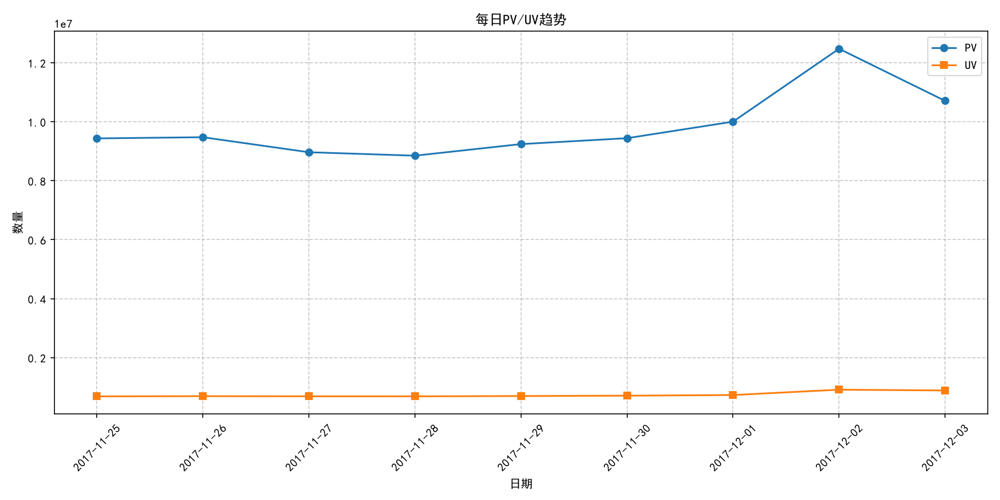
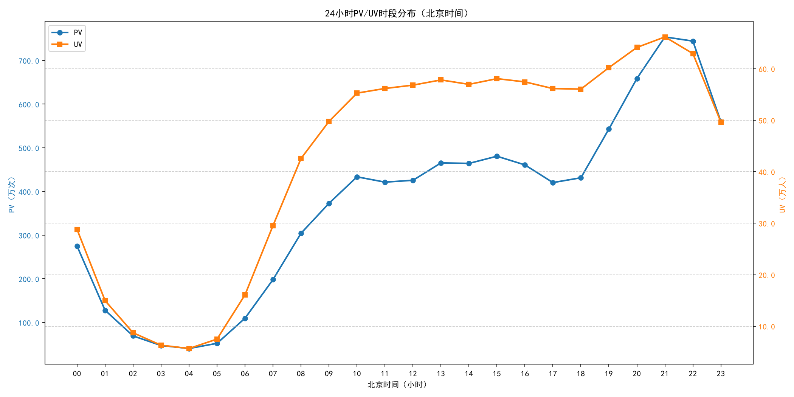
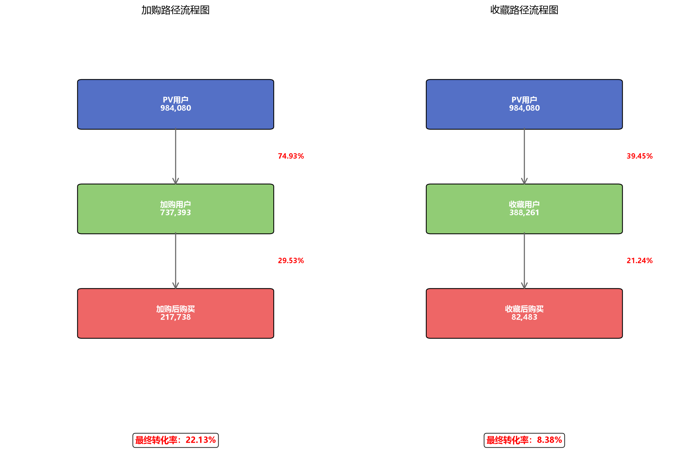
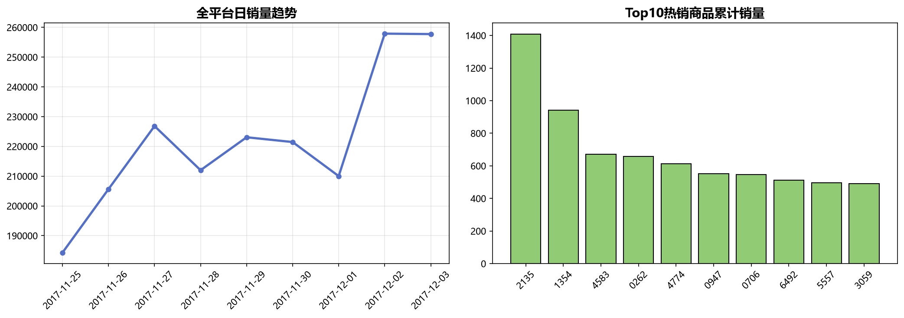
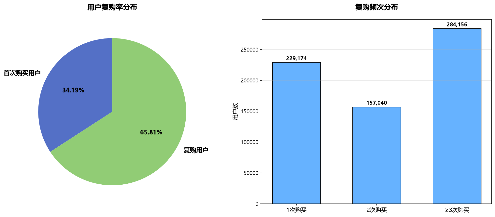
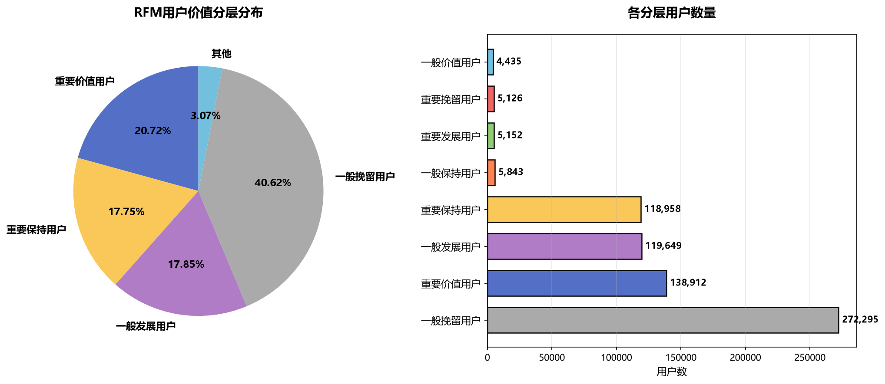

# 淘宝用户购物行为分析

**根据数据来源淘宝用户购物行为数据集的概述我们可以得知：**

**数据类型包含（用户点击，用户购买，加入购物车，收藏商品等行为），数据时间范围为2017年11月25日至2017年12月3日之间，用于研究用户习惯行为爱好。**

| 文件名称 | 说明 | 包含特征 |
| :--- | :--- | :--- |
| UserBehavior.csv | 包含所有的用户行为数据 | 用户ID，商品ID，商品类目ID，行为类型，时间戳 |

**本数据集包含了2017年11月25日至2017年12月3日之间，有行为的约一百万随机用户的所有行为（行为包括点击、购买、加购、喜欢）。数据集的组织形式和MovieLens-20M类似，即数据集的每一行表示一条用户行为，由用户ID、商品ID、商品类目ID、行为类型和时间戳组成，并以逗号分隔。关于数据集中每一列的详细描述如下：**

| 列名称 | 说明 |
| :--- | :--- |
| 用户ID | 整数类型，序列化后的用户ID |
| 商品ID | 整数类型，序列化后的商品ID |
| 商品类目ID | 整数类型，序列化后的商品所属类目ID |
| 行为类型 | 字符串，枚举类型，包括('pv', 'buy', 'cart', 'fav') |
| 时间戳 | 行为发生的时间戳 |

**注意到，用户行为类型共有四种，它们分别是：**

| 行为类型 | 说明 |
| :--- | :--- |
| pv | 商品详情页pv，等价于点击 |
| buy | 商品购买 |
| cart | 将商品加入购物车 |
| fav | 收藏商品 |

---

## 项目结构

```
UserDataAnalysis/
├── UserBehavior.csv                   # 原始数据（需自行下载）
├── UserBehavior_Clean.db              # 清洗后的SQLite数据库
├── RFM_User_Segments.csv              # RFM用户分层明细数据
│
├── User_Delete_dirty_data.py          # 数据清洗脚本
├── import_sqlite.py                   # 数据导入SQLite脚本
├── user_date_review.py                # 数据预览抽查脚本
│
├── day_pv_uv_bi_png.py                # 每日PV/UV趋势分析
├── tp_pv_uv_bi_png.py                 # 24小时时段PV/UV分布
├── Commodity_day_sales.py             # 商品日销量分析
├── Conversion_rate.py                 # 加购&收藏转化率分析
├── Repurchase_rate.py                 # 用户复购率分析
├── RFM_analysis.py                    # RFM用户价值分层分析
│
├── PV_UV趋势.png                      # 每日PV/UV趋势图
├── 24小时PV_UV_北京时间.png            # 24小时流量分布图
├── 商品日销量分析.png                  # 日销量+Top10热销商品
├── 竖版双路径流程图.png                # 加购/收藏转化漏斗
├── 复购率分析.png                     # 复购率饼图+频次分布
└── RFM用户分层分析.png                # RFM用户分层饼图+柱状图
```

---

## 快速开始

### 环境依赖

```bash
pip install pandas matplotlib
```

### 运行流程

```bash
# 1. 数据清洗（需先下载 UserBehavior.csv 到项目根目录）
python User_Delete_dirty_data.py

# 2. 导入SQLite数据库
python import_sqlite.py

# 3. 数据预览
python user_date_review.py

# 4. 运行各分析脚本（顺序无关）
python day_pv_uv_bi_png.py          # 每日PV/UV
python tp_pv_uv_bi_png.py           # 24小时时段分布
python Commodity_day_sales.py       # 商品日销量
python Conversion_rate.py           # 转化率漏斗
python Repurchase_rate.py           # 复购率
python RFM_analysis.py              # RFM用户分层
```

---

## 读数据，看脏数据，缺省值状况

```python
import pandas as pd

FILE = r"C:\Users\Administrator\Desktop\UserBehavior\UserBehavior.csv"

df = pd.read_csv(
    FILE,
    header=None,
    names=["user_id", "item_id", "category_id", "behavior_type", "timestamp"],
    chunksize=500_000
)

# 时间戳转时间，好做后续时段分析
df["datetime"] = pd.to_datetime(df["timestamp"], unit="s", errors="coerce")

# 随机抽样1000行做抽查
sample_df = df.sample(n=1000, random_state=123)  
print(sample_df[["user_id", "item_id", "behavior_type", "timestamp", "datetime"]].head(10))

print("时间范围：", df["datetime"].min(), "~", df["datetime"].max())
print(df["behavior_type"].value_counts(dropna=False))
print(df.isnull().sum())
```

**原始数据量为100,150,807行。抽样数据可以看到数据没有问题。数据结果可以看到行为分布类型pv（浏览）占89.58%，cart（加购）5.52%，fav（收藏）2.88%，buy（购买）2.01%，各类占比符合用户真实行为比例。**

**可以看到时间范围和官方文档给出的不一致。没有看到任何字段有缺失值，数据完整性很好。**


---

## 处理脏数据，转换格式

```python
import pandas as pd

FILE = r"C:\Users\Administrator\Desktop\UserBehavior\UserBehavior.csv"
start = pd.Timestamp("2017-11-25")
end   = pd.Timestamp("2017-12-03 23:59:59")

total = dirty = 0
chunks = []

for i, c in enumerate(pd.read_csv(
    FILE, header=None,
    names=["user_id","item_id","category_id","behavior_type","timestamp"],
    chunksize=500_000
)):
    total += len(c)
    c["datetime"] = pd.to_datetime(c["timestamp"], unit="s", errors="coerce")
    mask = c["datetime"].between(start, end)
    dirty += (~mask).sum()
    chunks.append(c[mask])

df = pd.concat(chunks, ignore_index=True)
df = df.drop(columns=["timestamp"])

print(f"总行数: {total:,}，脏数据: {dirty:,}，占比 {dirty/total:.2%}")
print(f"有效数据: {len(df):,}")
print(f"时间范围: {df['datetime'].min()} ~ {df['datetime'].max()}")

df.to_csv("UserBehavior_Clean.csv", index=False, header=False)
```

**清洗完可以看到脏数据占比 1.23%，占比不大。时间范围也锁定在2017年11月25日至2017年12月3日之间。**


---

## 入库处理（SQLite）

```python
import pandas as pd
import sqlite3
import os

csv_file = r"C:\Users\22073\Desktop\UserDataAnalysis\UserBehavior_Clean.csv"
db_file = r"C:\Users\22073\Desktop\UserDataAnalysis\UserBehavior_Clean.db"

conn = sqlite3.connect(db_file)
chunk_iter = pd.read_csv(
    csv_file, header=None,
    names=["user_id","item_id","category_id","behavior_type","datetime"],
    chunksize=100000
)

first = True
for chunk in chunk_iter:
    chunk["datetime"] = chunk["datetime"].astype(str)
    chunk.to_sql("user_behavior", conn, if_exists="replace" if first else "append", index=False)
    first = False

conn.close()

# 检查入库行数
conn = sqlite3.connect(db_file)
count = conn.execute("select count(*) from user_behavior").fetchone()[0]
print(f"入库完成，共 {count:,} 行")
conn.close()

os.remove(csv_file)
```

---

## 分析数据

### 1. 每日 PV/UV 趋势

**查询每日 pv（访问量），uv（访问人数）：**

```sql
SELECT
    SUBSTR(datetime, 1, 10) AS day,
    COUNT(*) AS pv,
    COUNT(DISTINCT user_id) AS uv
FROM user_behavior
WHERE behavior_type = 'pv'
GROUP BY SUBSTR(datetime, 1, 10)
ORDER BY day;
```



**看图表中可以看到访问量从 11-28 号开始稳步爬升，可能是近期推出活动有关。**

---

### 2. 24小时时段分布

**查询时段 pv（访问量），uv（访问人数）：**

```sql
SELECT 
    CASE 
        WHEN CAST(SUBSTR(datetime,12,2) AS INTEGER) + 8 >= 24 
        THEN CAST(CAST(SUBSTR(datetime,12,2) AS INTEGER) + 8 - 24 AS TEXT)
        ELSE CAST(CAST(SUBSTR(datetime,12,2) AS INTEGER) + 8 AS TEXT)
    END AS bj_hour,
    COUNT(*) as pv,
    COUNT(DISTINCT user_id) as uv
FROM user_behavior 
WHERE behavior_type='pv' 
GROUP BY bj_hour 
ORDER BY bj_hour
```



**可以看到从 PM 6点开始到 10点用户访问量和访问人数在攀升，凌晨的数据都是最低值。其中可以看到 AM10 点到 12 点访问人数在攀升，但是访问量在走 V 形，可能是 10 前后可能有定时推送通知，广告等。**

---

### 3. 转化率分析

**流程 A：商品点击 → 加入购物车 → 商品购买  
流程 B：商品点击 → 收藏商品 → 商品购买  
观察这两种流程下用户下单转化率。**

```sql
-- 加购用户数
SELECT COUNT(DISTINCT t1.user_id) 
FROM (SELECT DISTINCT user_id, item_id, category_id, datetime FROM user_behavior WHERE behavior_type='cart') t1

-- 加购后购买用户数
SELECT COUNT(DISTINCT t2.user_id) 
FROM (SELECT DISTINCT user_id, item_id, category_id, datetime FROM user_behavior WHERE behavior_type='cart') t1
LEFT JOIN (SELECT DISTINCT user_id, item_id, category_id, datetime FROM user_behavior WHERE behavior_type='buy') t2
ON t1.user_id = t2.user_id AND t1.item_id = t2.item_id AND t1.category_id = t2.category_id
WHERE t1.datetime < t2.datetime
```

**加入购物车用户 737,393，加入购物车并下单用户 217,738。加购转化率 217738/737393 ≈ 29.53%。**

```sql
-- 收藏用户数
SELECT COUNT(DISTINCT t1.user_id) 
FROM (SELECT DISTINCT user_id, item_id, category_id, datetime FROM user_behavior WHERE behavior_type='fav') t1

-- 收藏后购买用户数
SELECT COUNT(DISTINCT t2.user_id) 
FROM (SELECT DISTINCT user_id, item_id, category_id, datetime FROM user_behavior WHERE behavior_type='fav') t1
LEFT JOIN (SELECT DISTINCT user_id, item_id, category_id, datetime FROM user_behavior WHERE behavior_type='buy') t2
ON t1.user_id = t2.user_id AND t1.item_id = t2.item_id AND t1.category_id = t2.category_id
WHERE t1.datetime < t2.datetime
```

**收藏用户 388,261，收藏并下单用户 82,483。收藏转化率 82483/388261 ≈ 21.24%。**



| 路径 | 用户数 | 步骤转化率 | 最终转化率 |
|-----|--------|-----------|-----------|
| **加购路径** | 737,393 → 217,738 | 29.53% | **22.13%** |
| **收藏路径** | 388,261 → 82,483 | 21.24% | **8.38%** |

**流程对比情况下，用户在加购物车情况下更倾向于购买商品，可能在收藏情况下更倾向于观望商品。**

---

### 4. 商品日销量

**销量趋势里 12 月 1 号开始大幅度攀升，可能是这两天有平台活动导致，也可能是节假日推动了销量。**



---

### 5. 复购率分析

**复购率 = 复购用户数（>=2 次购买用户）/ 总购买用户数**



| 指标 | 数值 |
|-----|------|
| 总购买用户数 | 670,370 |
| 复购用户数 | 441,196 |
| 用户复购率 | **65.81%** |
| 购买1次用户 | 229,174 (34.19%) |
| 购买2次用户 | 157,040 (23.42%) |
| 购买≥3次用户 | 284,156 (42.38%) |

---

### 6. RFM用户价值分层分析 ⭐

**基于 R（最近购买天数）、F（购买频次）、M（购买商品多样性）三个维度，将67万购买用户分为8个层级。由于数据集无消费金额字段，M 使用购买不同商品数替代，代表消费广度。**

```sql
SELECT 
    user_id,
    MAX(DATE(datetime)) AS last_buy_date,
    COUNT(*) AS frequency,
    COUNT(DISTINCT item_id) AS diversity
FROM user_behavior
WHERE behavior_type = 'buy'
GROUP BY user_id
```



#### RFM 指标统计

| 指标 | 均值 | 中位数 | 范围 |
|-----|------|--------|------|
| R (Recency) | 2.6天 | 2天 | 0-8天 |
| F (Frequency) | 3.0次 | 2次 | 1-262次 |
| M (商品多样性) | 2.8个 | 2个 | 1-149个 |

#### 用户分层结果

| 分层 | 用户数 | 占比 | 运营策略 |
|-----|--------|------|---------|
| **重要价值用户** | 138,912 | 20.7% | 核心VIP，专属权益+个性化推荐 |
| **重要发展用户** | 5,152 | 0.8% | 限时优惠刺激复购 |
| **重要保持用户** | 118,958 | 17.7% | 优惠券/大促召回 |
| **重要挽留用户** | 5,126 | 0.8% | 紧急干预，大力度优惠 |
| 一般价值用户 | 4,435 | 0.7% | 品类交叉推荐 |
| 一般发展用户 | 119,649 | 17.8% | 新用户引导教育 |
| 一般保持用户 | 5,843 | 0.9% | 常规营销唤醒 |
| **一般挽留用户** | **272,295** | **40.6%** | 低成本触达尝试挽回 |

> **40.6% 的用户处于"一般挽留"层级，这是最大的流失风险群体；而"重要价值+重要保持"用户合计占比 38.4%，是平台核心资产。**

---

## 总结

| 分析维度 | 关键发现 |
|---------|---------|
| **流量趋势** | PV/UV 从11月28日起稳步爬升，晚18-22点为流量高峰 |
| **转化漏斗** | 加购转化率(29.53%)远超收藏(21.24%)，引导加购比引导收藏更有效 |
| **商品销售** | 12月1日起销量大幅攀升，可能与平台活动或节假日有关 |
| **复购率** | 65.81%用户有复购行为，平台用户粘性较强 |
| **RFM分层** | 40.6%用户处于流失边缘，38.4%为核心高价值用户 |

## 技术栈

- **数据处理**: Pandas
- **数据库**: SQLite3
- **可视化**: Matplotlib
- **分析方法**: PV/UV分析、转化漏斗、复购率、RFM分层模型

## 数据来源

[阿里巴巴天池 UserBehavior 数据集](https://tianchi.aliyun.com/dataset/649)
